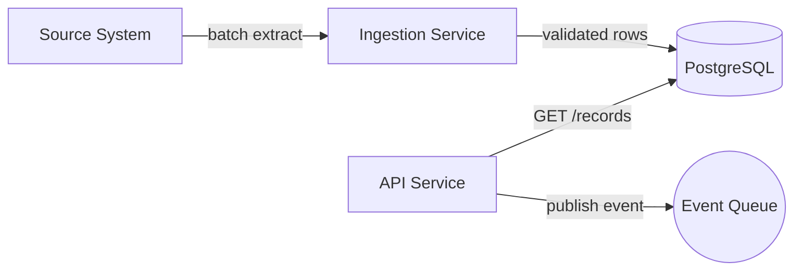
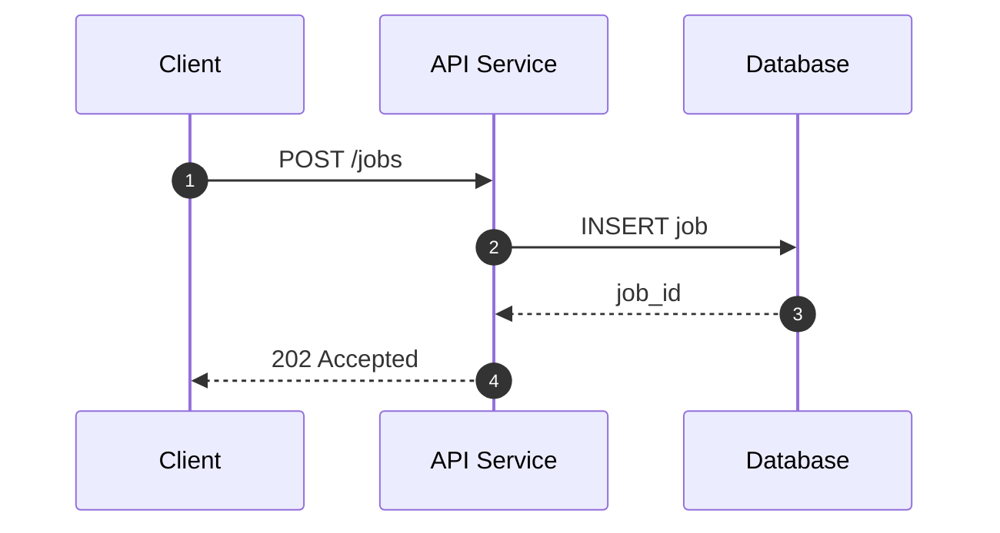
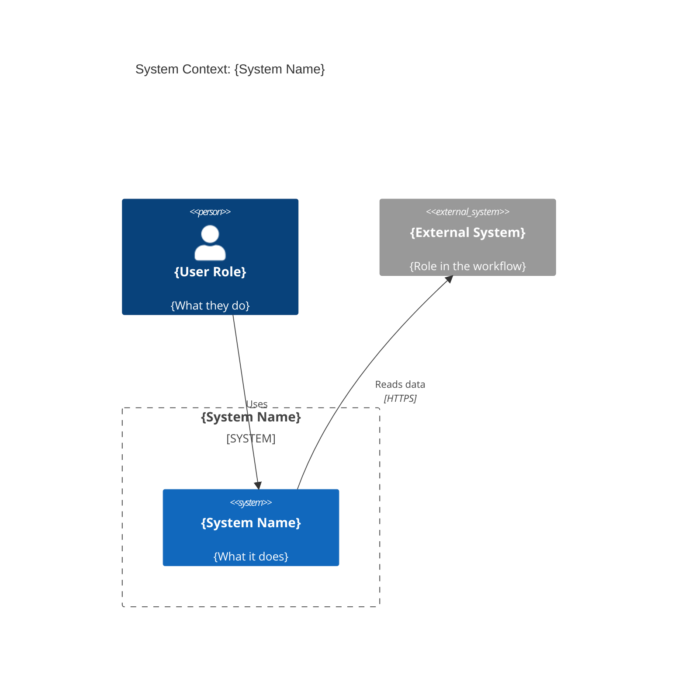
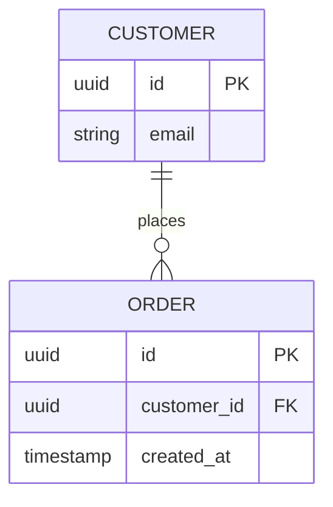
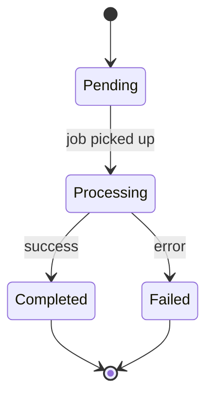
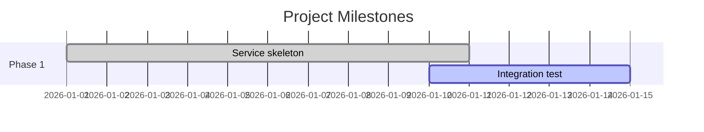

# Mermaid Author Skill

Create Mermaid diagrams that are factual, readable in raw Markdown, and render in GitHub Markdown and common Mermaid preview tools.

## Use This Skill For

- Creating or editing Mermaid diagrams in Markdown fences or standalone `.mmd` files.
- Translating confirmed architecture, process, sequence, state, timeline, or data-model facts into diagrams.
- Reviewing Mermaid syntax, labels, direction, references, and rendering risk.
- Adding diagram links or embedded diagrams to nearby documentation.

## Do Not Use This Skill For

- Presentation-ready diagrams that need manual layout control; use `diagram-author` and draw.io guidance instead.
- Inventing systems, actors, owners, protocols, SLAs, timings, or decisions not supported by repo context.
- Replacing prose with a diagram when the diagram would not improve understanding.

## Before Creating Or Editing

1. Read the target document and nearby docs first.
2. Search for existing `.mmd`, `.drawio`, or Markdown files with Mermaid fences to avoid duplicates.
3. Reuse existing names, boundaries, actors, protocols, and visual conventions.
4. If the source facts are missing or ambiguous, ask for the minimum clarification needed.

## Diagram Type Selection

| Need | Mermaid type | Use when |
|---|---|---|
| Data or control flow | `flowchart` | Showing systems, jobs, services, stores, and directional movement. |
| Interaction over time | `sequenceDiagram` | Showing ordered calls, events, retries, or acknowledgements. |
| System context | `C4Context` | Showing users, one system boundary, and external systems. |
| Containers | `C4Container` | Showing services, applications, jobs, queues, and databases inside a system. |
| Data model | `erDiagram` | Showing entities, keys, and relationships. |
| Lifecycle | `stateDiagram-v2` | Showing states and transitions. |
| Timeline | `gantt` | Showing phases, milestones, or delivery sequencing. |

Prefer `flowchart LR` for data flows and integrations. Prefer `flowchart TB` for hierarchy or ownership.

## Mermaid Syntax Rules

- Use a fenced code block with the `mermaid` language tag when embedding in Markdown.
- Use standalone Mermaid syntax without Markdown fences in `.mmd` files.
- Add `%%{init: {'theme': 'default'}}%%` when theme consistency matters.
- Label every arrow or relationship with the action, protocol, event, or data being exchanged.
- Keep node IDs short and stable; put readable names in labels.
- Keep node labels concise; avoid long sentences inside diagram nodes.
- Use quoted relationship labels when labels contain spaces, punctuation, or symbols.
- Prefer one diagram per concern; split diagrams that become hard to read.
- Avoid raw HTML in Mermaid labels because GitHub rendering support varies.

## Type-Specific Guidance

### Flowchart

Use flowcharts for architecture overviews, data movement, and process steps.

Rules:

- Use `[Label]` for services or steps.
- Use `[(Label)]` for databases or persistent stores.
- Use `((Label))` for events, queues, triggers, or milestones.
- Group related nodes with `subgraph` only when it clarifies ownership or boundaries.

### Sequence Diagram

Use sequence diagrams for interactions ordered by time.

Rules:

- Use `autonumber` unless numbering would distract.
- Use `participant id as Label` for readable names.
- Use `Note over` or `Note right of` only for invariants or important constraints.
- Keep payload examples short and representative.

### C4 Diagrams

Use C4 only for architecture views where the C4 level is clear.

Rules:

- Use `C4Context` for users, the system, and external systems.
- Use `C4Container` for services, jobs, applications, queues, and data stores inside one system.
- Use `C4Component` only when one container is the clear scope.
- Include protocols or data types on `Rel` entries when known.

### Entity Relationship Diagram

Use ER diagrams for conceptual or physical data relationships.

Rules:

- Mark primary keys with `PK` and foreign keys with `FK` when known.
- Do not infer cardinality without source evidence.
- Keep attributes to the fields needed for the diagram purpose.

### State Diagram

Use state diagrams for lifecycle transitions.

Rules:

- Label transitions with the event or condition.
- Include failure and terminal states when relevant.
- Do not add states that are not documented or implied by code/configuration.

### Gantt

Use Gantt diagrams only for timelines with known or requested dates.

Rules:

- Use `TBD` for unknown dates instead of inventing them, or ask for dates before generating.
- Keep milestones high-level; detailed project planning belongs in prose or backlog tools.

## Placement And Links

- Follow the target repo's `AGENTS.md`, `CLAUDE.md`, docs README, or existing diagram folder conventions.
- Default to embedded Markdown when the diagram supports a specific document.
- Use `.mmd` when the diagram is standalone or reused by multiple docs.
- When adding a standalone diagram, add or update a nearby Markdown link when it helps discoverability.
- Use relative links for internal references.
- Do not add exported PNG/SVG assets unless explicitly requested.

## Output Contract

When delivering Mermaid work, include:

- File path created or updated.
- Diagram type and why it fits.
- Rendering target, such as GitHub Markdown, VS Code Mermaid Preview, or Mermaid Live.
- Any simplifications, assumptions, or `TBD` values.

## Quality Checklist

- Diagram is based on confirmed facts from repo context or user input.
- Mermaid type matches the problem being visualized.
- Syntax is valid for the intended rendering target.
- Embedded diagrams use fenced code blocks with the `mermaid` language tag.
- Standalone `.mmd` files do not include Markdown fences.
- Every arrow or relationship has a useful label.
- Labels use repo terminology consistently.
- Diagram scope is focused and readable.
- Nearby docs link to standalone diagrams when relevant.
- No speculative systems, owners, protocols, or dates were introduced.
